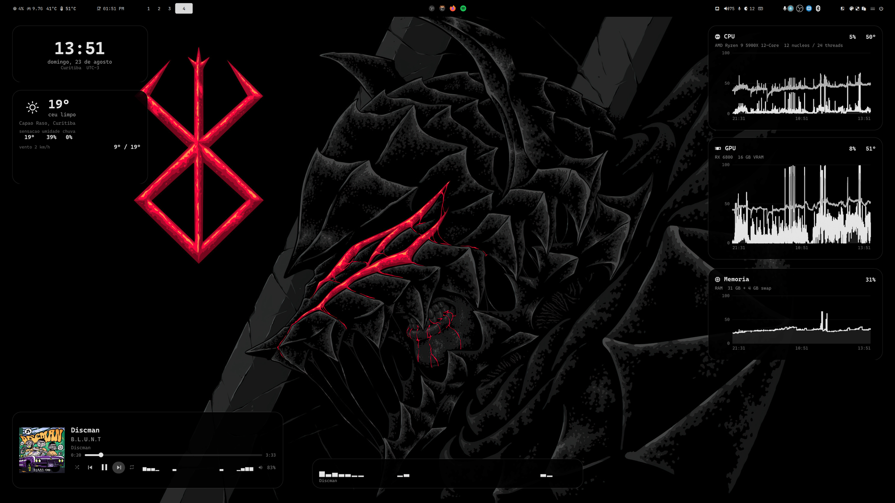
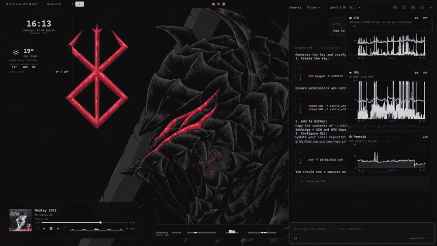

<div align="center">

# hyde-setup

**Post-install setup for [HyDE](https://github.com/HyDE-Project/HyDE) on Arch.**

```
Arch minimal  →  HyDE  →  hyde-setup
```

Automates what HyDE leaves out: extra packages, a local LLM with GPU
acceleration, two custom modules, Portuguese accents on a US keyboard, monitor
setup and app integrations.

</div>

---

## The result

<div align="center">
  
  <p><em>What the five stages add up to. Spotify is playing from the tray &mdash;
  it started with the session and never took a workspace.</em></p>
</div>

<div align="center">
  
</div>

<div align="center">
  
  <p><em>It all comes from the same wallbash. A theme switch repaints the bar, the
  desktop widgets and the LLM sidebar together &mdash; light themes included.</em></p>
</div>

---

## Installation

### 1. Base

Arch Linux with [HyDE](https://github.com/HyDE-Project/HyDE) already installed.
This repository **runs afterwards** — it assumes a working Hyprland and
`~/.config/hypr` in place.

### 2. Clone

```bash
git clone https://github.com/reanlucas/hyde-setup.git
cd hyde-setup
```

### 3. First run — generates the config

```bash
./install.sh
```

Creates `setup.conf` from the example and stops, applying nothing.

### 4. Fit it to your hardware

```bash
$EDITOR setup.conf
```

The minimum to review:

| Key | How to find it |
|---|---|
| `MONITOR_SAIDA` `MONITOR_MODO` | `hyprctl monitors` |
| `MONITOR_ESCALA` | the division must come out whole — `2560/1.25 = 2048` ✅ |
| `GPU_VENDOR` `OLLAMA_PACOTE` | `amd` → `ollama-rocm`, otherwise `ollama` |
| `OLLAMA_MODELO` | must fit in your VRAM |
| `KB_VARIANT` | `intl` or `altgr-intl` — see below |

### 5. Apply

```bash
./install.sh
```

Idempotent: running it again reapplies without duplicating. To rerun a single
stage:

```bash
./install.sh 20
```

### 6. Afterwards

```bash
hyde-widgets --show     # desktop widgets
hyde-ai --setup         # checks the chat's Hermes backend
                        # (API keys: /key in the panel, or ~/.hermes/.env)
```

---

## The stages

| Stage | Contents |
|---|---|
| `10-pacotes` | HyDE extras, tooling, `ollama` tuned for the GPU, first model |
| `20-hyprland` | monitor, keyboard, keybinds, autostart and Spotify in the tray |
| `30-teclado` | `~/.XCompose` so `'` + `c` gives ç |
| `40-apps` | Spotify flags, spicetify, `Ctrl+C`/`Ctrl+V` in kitty, VS Code theme, waybar scale, Vulkan |
| `45-nautilus` | Nautilus, gvfs, thumbnails, kitty in the context menu, and the MacOS theme recoloured by wallbash |
| `50-modulos` | clones and installs `hyde-widgets`, `hyde-ai` and its backend, `hermes-agent` |

---

## Keyboard

Two options, both on top of the US layout:

| | `intl` | `altgr-intl` |
|---|---|---|
| `'` `"` `` ` `` `~` | dead keys | **plain** |
| Accent | `'` + `a` = á | `AltGr` + `'` + `a` = á |
| Cedilla | `'` + `c` = ç ¹ | `AltGr` + `,` = ç |
| Writing code | quotes get in the way | no friction |

¹ needs the `~/.XCompose` that stage `30` installs — xkb on its own maps
`'` + `c` to `ć`, a letter Portuguese does not have.

---

## Decisions worth explaining

<details>
<summary><b>The user override, never HyDE's own files</b></summary>

Everything is written to `~/.config/hypr/hyprland.lua`, which HyDE does not
overwrite on update. The block is delimited by markers and rewritten whole on
every run, which is what keeps the script idempotent.

</details>

<details>
<summary><b>cm = "srgb", not "hdr"</b></summary>

Turning HDR on maps SDR content to a ~80-nit reference and **darkens** the
desktop — the opposite of what you'd expect. It only pays off with real HDR
content.

</details>

<details>
<summary><b>The scale has to land on whole pixels</b></summary>

`2560 / 1.25 = 2048` works. `2560 / 1.3` doesn't divide evenly, and the result
is blurry text.

</details>

<details>
<summary><b>git url.insteadOf for https</b></summary>

Several PKGBUILDs clone over `http://`, which corporate networks block — `paru`
then hangs with no error message. Stage `10` configures the rewrite.

</details>

<details>
<summary><b>HyDE's <code>Shift+F11</code> looks broken, and isn't</b></summary>

The stock bind cycles **three** states: `0` → `1` (maximise) → `2`
(fullscreen). In a tiling layout state `1` is visually identical to the window
already tiled, so the first press changes nothing on screen — fullscreen only
arrives on the second, and leaves on the third.

Stage `20` swaps it for a straight toggle, in and out on one key:

```lua
hl.bind("SHIFT + F11", hl.dsp.window.fullscreen(), { ... })
```

Since the user override loads after HyDE and the *flags* match, the bind is
replaced rather than duplicated. `SUPER + F` is bound to the same thing, for
keyboards whose F-row sends media keysyms.

</details>

<details>
<summary><b>Nautilus: the MacOS theme, recoloured by wallbash</b></summary>

HyDE already themes GTK4: on a theme switch it points `~/.config/gtk-4.0` at
`<theme>/gtk-4.0`, and GTK loads that `gtk.css` as *user* CSS, outranking
libadwaita's own sheet. libadwaita 1.6 moved its colours to CSS variables but
kept a compatibility layer — its `:root` sets `--window-bg-color:
@window_bg_color` — so a theme's `@define-color` still reaches the variable.
Nautilus therefore comes up almost fully themed with no help at all. I assumed
the opposite until I measured it.

Two things don't reach it:

**The colours the themes never declared.** Of the 48 themes with a `gtk-4.0`
directory here, 44 define none of the `@sidebar_*` family — and in a file
manager the sidebar is half the window, sitting in Adwaita's grey `#2E2E32`
against a themed window. About half define **none** of the 42, dropping to
stock Adwaita entirely.

**The shape.** No HyDE theme has the sidebar-pane-detached-from-content look
that makes a Finder window read as one.

The MacOS theme has the shape, but its colours are nailed down: 1203 literals,
including `.sidebar { background-color: #333333 }`, so redefining
`@define-color` does nothing. `gerar-macos-dcol.py` rewrites the stylesheet
instead, turning each literal into a wallbash token, and emits it as a template
in `always/` — which HyDE re-renders on every theme change, like its own.

Each colour is classified before being replaced: greys (saturation under 12%)
go to the group-1 ramp, the wallpaper's dominant colour; blues (hue 190–260,
the theme's accent family) go to the group-4 ramp, HyDE's accent; red, green
and orange are left alone, because error and success shouldn't become shades of
the wallpaper. Position on the ramp comes from luminance *rank*, not absolute
value, so all nine steps are used whatever palette wallbash produces. And since
`#333333` (background) and `#373737` (hover) would land on the same step and
become the same colour — killing the hover — each one also carries a `shade()`
relative to its step's median.

**Transparency comes from the compositor, and one HyDE rule was blocking it.**
HyDE ships `filemanagers-fullscreen`, matching `.*Nautilus.*` with `opaque =
true` — which makes Hyprland skip opacity *and* blur for that window. While
that stands nothing shows through, from the compositor or from CSS alpha, and
the same rule forces `float = false` (dolphin escapes it by being in the
floating-class list). The window rule in stage 45 turns both off and sets
`opacity`.

It is uniform across the window. Making **only** the sidebar see-through is
what I could not do, and the honest record of it is: the sidebar renders
byte-identical over two completely different wallpapers, so it is fully opaque,
and none of the CSS routes changed that — alpha on `window.background`, on
`toolbarview`, on every sidebar class and their `:backdrop` twins, repeating the
theme's own high-specificity selectors to win on position, even resetting every
container and repainting one layer at a time. Two things did come out of the
search and are worth keeping: the theme's `.nautilus-window` rules are dead
weight on Nautilus 50, which no longer uses that class; and alpha painted on
nested widgets stacks, so the same 0.62 on `.sidebar`, `.sidebar-pane`,
`.navigation-sidebar` and `.sidebar list` composites to 0.98. Compositor opacity
is the lever that works, and it takes the whole window.

The 42 libadwaita variables are declared from the same palette, since the
MacOS port predates them. One bug of the theme's own is fixed on the way
through: four calls to `gtkmix()`, which is not a GTK4 function — GTK dropped
those rules with *Expected a valid color*. The output parses with zero errors,
which the untouched theme does not.

`gtk4-adw.py` runs as the template's `exec_command` and rebuilds
`~/.config/gtk-4.0` as a real directory — right after HyDE has recreated the
symlink. If the script ever disappears, the symlink comes back on the next
switch: what is lost is the patch, not the theme.

With `NAUTILUS_MACOS=0` the shape is left alone and only the missing colours
are filled in, from the active theme.

**A theme change recolours it; a wallpaper change does not** — not by itself.
HyDE ships `enableWallDcol=0`, which means the wallbash palette comes from the
theme's own `.dcol`, not from the current wallpaper. Measured: switching Rosé
Pine → Tokyo Night moved the palette from `#584268` to `#2A2A3A` and the
stylesheet followed; changing wallpaper inside a theme moved nothing. Set
`enableWallDcol=1` in `~/.config/hyde/config.toml` and the wallpaper drives it
too — for this and for everything else HyDE colours.

Since the user stylesheet is global to GTK4, this is the look every GTK4 app
gets, not only Nautilus. `GTK_THEME=<name>` does scope a theme to one app, but
the user stylesheet outranks it, so the scoped theme loses — verified.

</details>

<details>
<summary><b><code>Ctrl+C</code> in the terminal without losing SIGINT</b></summary>

kitty uses `copy_or_interrupt`, not `copy_to_clipboard`: with a selection it
copies, without one it sends the usual `SIGINT`. Mapping it straight to copy
would take away the key's most frequent job in a terminal.

`Ctrl+Shift+C` and `Ctrl+Shift+V` keep working.

</details>

<details>
<summary><b>Spotify in the tray without <code>--minimized</code></b></summary>

Spotify's `--minimized` **does not work on Linux** — `spotify --help` says so
itself: "Only works on Windows". On Hyprland the window rule is what minimises:
the client starts with the session and goes straight to the scratchpad, without
stealing focus or taking a workspace.

```lua
hl.window_rule({
    match            = { class = "^([Ss]potify)$" },
    workspace        = "special silent",
    no_initial_focus = true,
})
```

`SUPER + S`, HyDE's own bind, reveals the window. The tray icon and the player
widget drive playback without it.

A `.desktop` in `~/.config/autostart` wouldn't help either: Hyprland does not
fire `xdg-desktop-autostart` on its own.

</details>

<details>
<summary><b>Ollama tuning</b></summary>

Flash attention, `q8_0` KV cache and a 32k context — all of it fitting on the
GPU. Without this the context stays at the default 4096, which is not much.

</details>

---

## What this repository guarantees — and what it doesn't

Running `install.sh` on a fresh Arch with HyDE reproduces **every setting** on
this machine: monitor, accented keyboard, keybinds, autostart, Spotify in the
tray, kitty, VS Code, waybar scale, Ollama and both modules. The scripts are
idempotent and were tested writing into a throwaway `HOME`.

What is **not** under this repository's control:

| | |
|---|---|
| Package versions | nothing is pinned; installing today gets what the repos hold today |
| HyDE themes | they come from HyDE's installer, not from here |
| API keys | deliberately left out — they live with Hermes (`/key` in the panel, or `~/.hermes/.env`) |
| The Ollama model | a few GB of download |
| Different hardware | `setup.conf` needs editing; the example carries this machine's values |

---

## Modules

| | |
|---|---|
| [hyde-widgets](https://github.com/reanlucas/hyde-widgets) | desktop widgets in Quickshell |
| [hyde-ai](https://github.com/reanlucas/hyde-ai) | LLM chat in a sidebar · **beta** |

---

## Licence

MIT
